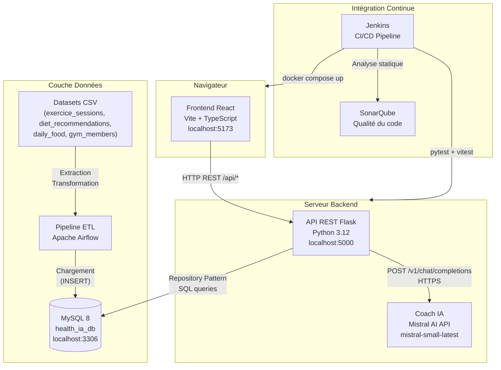
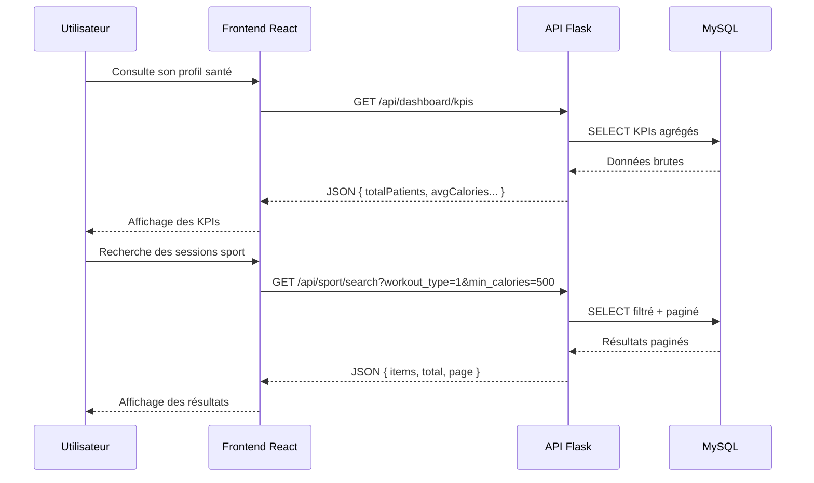

# Architecture Logicielle — HealthIA

## Vue d'ensemble

HealthIA est une application web full-stack composée de quatre couches distinctes communiquant via des APIs REST et un bus de données ETL.

---

## Diagramme d'architecture

---

## Description des composants

### Frontend — React (Vite + TypeScript)
- Interface utilisateur responsive et accessible (WCAG : `aria-label`, `aria-current`)
- Routing côté client avec React Router
- Appels API centralisés via des hooks personnalisés
- Tests unitaires : Vitest + React Testing Library

### API REST — Flask (Python)
- Architecture en couches : Routes → Repositories → MySQL
- Authentification par session
- CORS restreint via variable d'environnement `CORS_ALLOWED_ORIGINS`
- Binding configurable `FLASK_HOST` (127.0.0.1 local, 0.0.0.0 Docker)

### Coach IA — Mistral AI
- Modèle : `mistral-small-latest` via l'API REST Mistral AI (`https://api.mistral.ai/v1/chat/completions`)
- Clé API configurée via variable d'environnement `MISTRAL_API_KEY`
- Prompt système enrichi dynamiquement avec : profil santé (IMC, objectif, niveau d'expérience) + dernières séances sportives enregistrées par l'utilisateur
- Endpoints Flask :
  - `POST /api/coach/chat` — reçoit le message utilisateur, appelle Mistral, persiste l'échange en base, retourne la réponse
  - `GET /api/coach/history/<user_id>` — charge l'historique des 50 derniers messages
  - `DELETE /api/coach/history/<user_id>` — efface l'historique (bouton "Nouvelle conversation")
- Historique persisté en base (`coach_messages`) : rechargé automatiquement à chaque connexion
- Fallback frontend : si le backend est injoignable, réponses contextuelles locales

### Base de données — MySQL 8
- 46 migrations versionnées (Pyway V1_01 → V1_46)
- Tables principales : `utilisateurs`, `exercice_sessions`, `diet_recommendations`, `publications`, `workout_types`, `utilisateurs_allergies`, `utilisateurs_pathologies`, `utilisateurs_blessures`, `coach_messages`, `user_sessions`
- Repository Pattern pour l'accès aux données (16+ repositories)

### Base de données — MongoDB (NoSQL)
- Stockage des logs de recommandations ML (données semi-structurées, schéma flexible)
- Collection `healthia_logs.recommendation_logs` : `{ user_id, recommendations[], created_at }`
- Connexion via `pymongo` — timeout 2s, échec silencieux si indisponible
- Justification NoSQL : un log de recommandation varie en structure selon l'utilisateur — pas adapté au relationnel

### Modèle ML — Random Forest (scikit-learn)
- Notebook d'entraînement : `HealthIABack/notebook/recommandationModeleIA.ipynb`
- Algorithme : OneVsRest + RandomForestClassifier (200 arbres, max_depth=10)
- Features : `objectif`, `user_imc`, `user_age`, `experience_level`, `user_weight_kg`, `user_height_cm`
- Cible : classification multi-label sur 9 types d'exercices
- Données d'entraînement : 201 utilisateurs, 2482 séances (MySQL → DataFrame)
- Performances : Hit Rate@5 = 100%, Top-1 accuracy = 90,24%
- Artefacts sauvegardés : `app/models/model.pkl`, `encoder.pkl`, `preprocessor.pkl`, `meta.pkl`
- Intégration Flask : endpoint `GET /api/recommendations/<user_id>` — lazy loading du modèle en mémoire

### Monitoring — Prometheus + Grafana + cAdvisor
- `prometheus` (port 9090) : scrape les métriques de tous les conteneurs
- `grafana` (port 3000) : tableaux de bord de supervision en temps réel
- `cadvisor` (port 8082) : métriques CPU, RAM, réseau par conteneur Docker
- `mysql-exporter` (port 9104) : métriques MySQL exposées pour Prometheus
- Configuration : `prometheus.yml` à la racine du projet

### Vision IA — Ollama + LLaVA
- `ollama` (port 11434) : LLM vision local (`llava:latest`)
- Endpoint `POST /analyze` (FastAPI microservice) : analyse une photo de repas → JSON `{ foods[], calories_kcal, confidence }`
- Implémenté dans `HealthIABack/app/food.py`

### Pipeline ETL — Apache Airflow
- 4 DAGs de production pour l'ingestion des données CSV sources (exercice_sessions, diet_recommendations, daily_food, food_categories)
- Transformation et nettoyage avant chargement en base
- Planification automatique des imports

### CI/CD — Jenkins + SonarQube
- Pipeline automatisé : SonarQube → Tests → Build Docker → Deploy → Health Check
- Rapports de couverture HTML (pytest-cov + Vitest)
- Rapports JUnit XML pour visualisation des tendances de tests
- Health check avec un sleep de 30 sec ( démarrage en 26 secs en moyenne)

---

## Flux de données

---

## Choix techniques justifiés

| Choix | Justification |
|---|---|
| Flask vs Django | Légèreté et flexibilité pour une API REST pure, sans ORM imposé |
| Repository Pattern | Séparation claire entre logique métier et accès aux données — testable via mocks |
| MySQL vs NoSQL | Données relationnelles structurées (patients ↔ sessions ↔ recommandations) |
| Vite vs Create React App | Build 10× plus rapide, HMR natif, standard actuel de l'écosystème React |
| Docker Compose | Orchestration locale reproductible — même commande pour tous les environnements |
| Mistral AI vs OpenAI | LLM européen (RGPD-friendly), API REST simple, modèle `mistral-small-latest` performant et économique |
| Appel HTTP direct vs SDK mistralai | Évite les dépendances instables — `requests` est déjà présent dans l'environnement Flask |
| MongoDB pour les logs ML | Données semi-structurées (liste variable de recommandations) — schéma NoSQL plus adapté que des colonnes relationnelles |
| RandomForest vs réseau de neurones | Interprétable, rapide à entraîner sur 2482 samples, pas besoin de GPU — performances suffisantes (90% top-1) |
| Lazy loading du modèle ML | Le fichier `.pkl` (3 Mo) est chargé une seule fois en mémoire au premier appel — pas de I/O disque à chaque requête |
