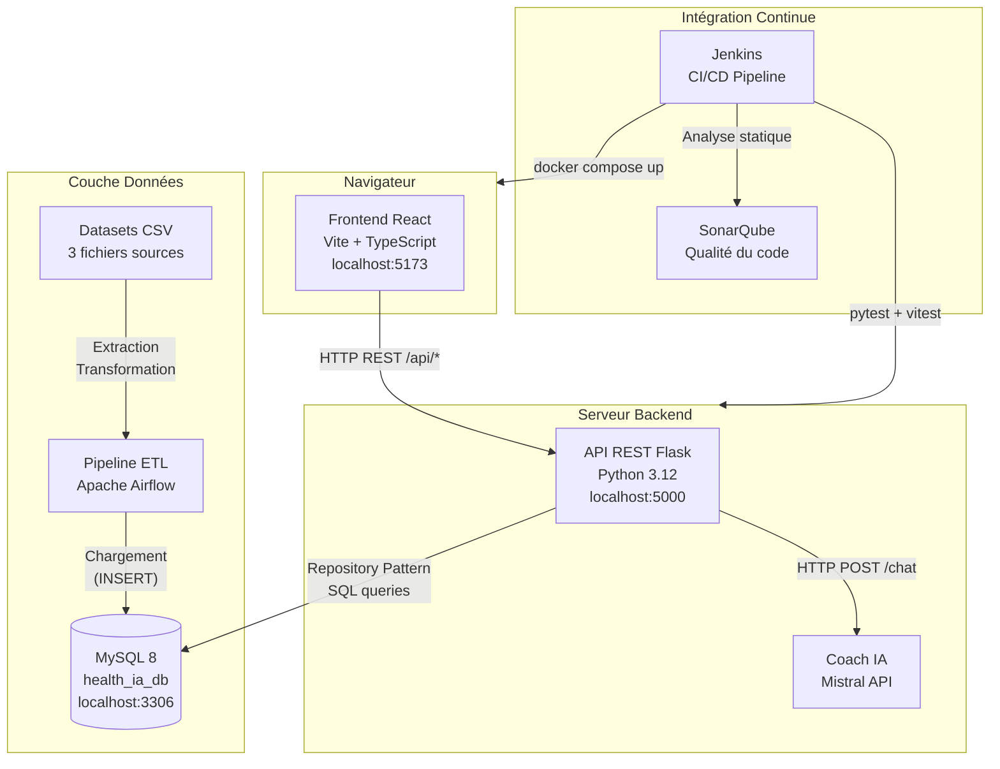
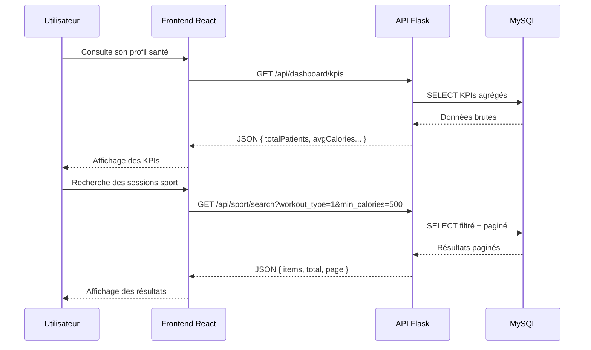

# Architecture Logicielle — HealthIA

## Vue d'ensemble

HealthIA est une application web full-stack composée de quatre couches distinctes communiquant via des APIs REST et un bus de données ETL.

---

## Diagramme d'architecture

---

## Description des composants

### Frontend — React (Vite + TypeScript)
- Interface utilisateur responsive et accessible (WCAG : `aria-label`, `aria-current`)
- Routing côté client avec React Router
- Appels API centralisés via des hooks personnalisés
- Tests unitaires : Vitest + React Testing Library

### API REST — Flask (Python)
- Architecture en couches : Routes → Repositories → MySQL
- Authentification par session
- CORS restreint via variable d'environnement `CORS_ALLOWED_ORIGINS`
- Binding configurable `FLASK_HOST` (127.0.0.1 local, 0.0.0.0 Docker)

### Coach IA — Mistral
- Intégration via API Mistral (clé `MISTRAL_API_KEY`)
- Génération de conseils personnalisés basés sur le profil utilisateur

### Base de données — MySQL 8
- 35 migrations versionnées (Flyway/Pyway V1_01 → V1_35)
- Tables principales : `utilisateurs`, `exercice_sessions`, `diet_recommendations`, `publications`, `workout_types`
- Repository Pattern pour l'accès aux données (20+ repositories)

### Pipeline ETL — Apache Airflow
- 3 DAGs pour l'ingestion des données CSV sources
- Transformation et nettoyage avant chargement en base
- Planification automatique des imports

### CI/CD — Jenkins + SonarQube
- Pipeline automatisé : SonarQube → Tests → Build Docker → Deploy → Health Check
- Rapports de couverture HTML (pytest-cov + Vitest)
- Rapports JUnit XML pour visualisation des tendances de tests
- Health check avec un sleep de 30 sec ( démarrage en 26 secs en moyenne)

---

## Flux de données

---

## Choix techniques justifiés

| Choix | Justification |
|---|---|
| Flask vs Django | Légèreté et flexibilité pour une API REST pure, sans ORM imposé |
| Repository Pattern | Séparation claire entre logique métier et accès aux données — testable via mocks |
| MySQL vs NoSQL | Données relationnelles structurées (patients ↔ sessions ↔ recommandations) |
| Vite vs Create React App | Build 10× plus rapide, HMR natif, standard actuel de l'écosystème React |
| Docker Compose | Orchestration locale reproductible — même commande pour tous les environnements |
