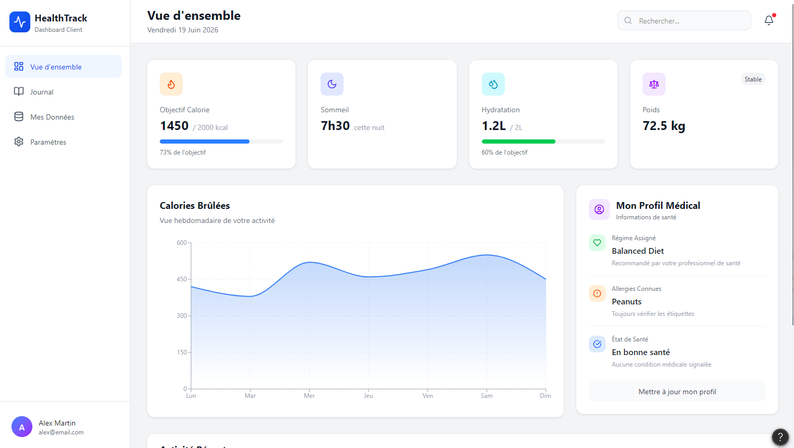

# Maquettes — HealthIA

## Processus de conception

La conception visuelle s'est déroulée en deux étapes :

1. **Wireframes basse fidélité (draw.io)** — cadrage des besoins et de la structure des écrans
2. **Maquettes haute fidélité (Figma)** — validation de l'identité visuelle et du design final

---

## Niveau 1 — Wireframes (draw.io)

Réalisés manuellement pour cadrer les besoins utilisateurs avant le développement.

Fichiers source draw.io : [Accéder aux fichiers draw.io (Google Drive)](https://drive.google.com/drive/folders/1IHREqZHPMFyAHUeclpHm3qw6ngtKIWbG?usp=drive_link)

### Dashboard

**Éléments représentés :**
- Sidebar de navigation avec tous les modules
- 4 cards KPI : Calories, IMC, Sessions, Objectif
- Graphique en barres — activité de la semaine
- Bloc profil médical (régime, allergies)

---

### Communauté (Forum)

**Éléments représentés :**
- Formulaire de nouvelle publication (champ texte + bouton Publier)
- Fil de publications avec avatar, pseudo, horodatage, contenu
- Lien "Commenter" par publication

---

### Profil utilisateur

**Éléments représentés :**
- Photo de profil + nom + email
- Formulaire de modification (nom d'affichage, email, mot de passe)
- Bouton "Enregistrer" + bouton "Déconnexion"

---

### Coach IA

**Éléments représentés :**
- Interface de chat : bulles utilisateur (droite) et réponses IA (gauche)
- Champ de saisie "Posez votre question..." + bouton "Envoyer"
- Historique de conversation scrollable

---

## Niveau 2 — Maquettes haute fidélité (Figma)

[Ouvrir les maquettes Figma](https://www.figma.com/make/6fjDfOK09Fm4P8VDkx5R7d/Patient-Dashboard-Code-Generation?t=5LEvR8QVw9ISh9E0-1)

Les captures statiques sont disponibles dans le dossier [`docs/maquettes/`](maquettes/).

---

## Contexte de conception

Les maquettes ont été réalisées en amont du développement pour cadrer les besoins utilisateurs et valider l'architecture visuelle avant de coder. Le branding "HealthTrack" visible dans les maquettes Figma a été adapté en "Santé & Fit" lors du développement, suite à une décision d'équipe pour mieux refléter le positionnement du produit final. La structure des écrans et les fonctionnalités représentées ont été conservées.

Le projet cible deux types d'utilisateurs :
- **Utilisateur standard** : consulte son tableau de bord santé, ses données d'activité et accède au Coach IA
- **Administrateur** : gère les recommandations nutritionnelles et les données patients

---

### Écran 1 — Vue d'ensemble (Dashboard)

**Fonctionnalités représentées :**
- KPIs santé en temps réel : objectif calorique, sommeil, hydratation, poids
- Graphique hebdomadaire des calories brûlées
- Profil médical rapide : régime assigné, allergies connues, état de santé
- Navigation latérale avec accès à tous les modules

**User stories couvertes :**
- En tant qu'utilisateur, je veux voir mes indicateurs de santé clés en un coup d'œil
- En tant qu'utilisateur, je veux visualiser l'évolution de mon activité sur la semaine
- En tant qu'utilisateur, je veux accéder à mon profil médical depuis le tableau de bord

---

### Écran 2 — Suivi des activités

**Fonctionnalités représentées :**
- Bilan calorique journalier (consommé / brûlé / solde net)
- Historique chronologique des repas et séances d'entraînement
- Ajout d'une nouvelle entrée (repas ou activité)
- Filtres par date

**User stories couvertes :**
- En tant qu'utilisateur, je veux enregistrer mes repas et activités au quotidien
- En tant qu'utilisateur, je veux voir mon bilan calorique du jour en temps réel

---

### Écran 3 — Statistiques personnelles

**Fonctionnalités représentées :**
- KPIs de progression : perte de poids, calories brûlées, adhésion au régime, qualité du sommeil
- Graphique d'évolution du poids sur 6 semaines
- Bilan calorique hebdomadaire (consommées vs brûlées)

**User stories couvertes :**
- En tant qu'utilisateur, je veux suivre ma progression santé sur le long terme
- En tant qu'utilisateur, je veux comparer mes calories consommées et brûlées par semaine

---

## Correspondance maquette → implémentation

| Écran maquetté | Route implémentée | Wireframe | Statut |
|---|---|---|---|
| Vue d'ensemble | `/` | ✅ | ✅ Implémenté |
| Suivi activités | `/nutrition` | ✅ | ✅ Implémenté |
| Statistiques | `/sport` + `/patients` | ✅ | ✅ Implémenté |
| Coach IA | `/coach-ia` | ✅ | 🔄 En cours |
| Communauté | `/community` | ✅ | ✅ Implémenté |
| Profil utilisateur | `/profile` | ✅ | ✅ Implémenté |

---

## Choix de design

| Décision | Justification |
|---|---|
| Sidebar fixe à gauche | Navigation permanente pour accès rapide entre modules |
| Thème sombre (slate-800) | Réduction de la fatigue visuelle pour usage prolongé |
| Couleur emerald pour les actions | Identité "santé/nature", différenciation claire des éléments interactifs |
| Cards KPI en haut de page | Les métriques clés sont visibles sans scroll |
